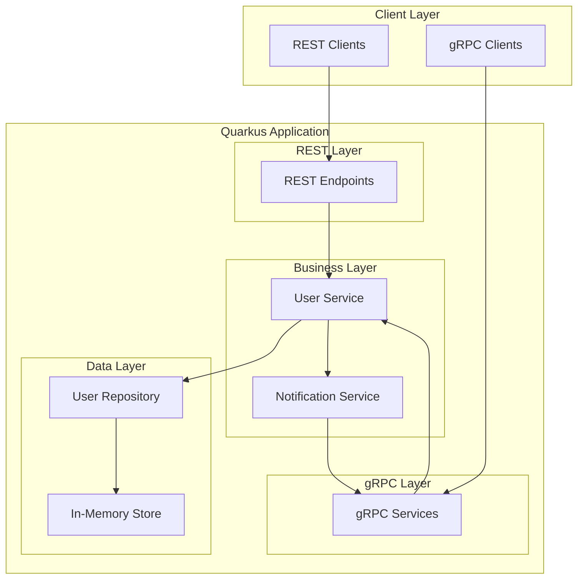

# Design Document

## Overview

This design outlines a comprehensive gRPC learning service built with Quarkus that demonstrates all major gRPC patterns while integrating with REST reactive endpoints. The service will implement a user management system that showcases unary calls, server streaming, client streaming, and bidirectional streaming, alongside REST endpoints that bridge to the gRPC services using Quarkus's reactive capabilities.

The architecture follows Quarkus best practices, utilizing Mutiny for reactive programming, proper error handling across both gRPC and REST layers, and comprehensive logging for educational purposes.

## Architecture

### High-Level Architecture



### Technology Stack

- **Framework**: Quarkus with gRPC extension
- **Reactive Library**: Mutiny (Uni/Multi)
- **Protocol Buffers**: For gRPC service definitions
- **REST**: Quarkus REST (RESTEasy Reactive) with Jackson
- **Data Storage**: In-memory concurrent data structures (for simplicity)
- **Logging**: Quarkus logging with structured output
- **Testing**: JUnit 5 with Quarkus Test framework

## Components and Interfaces

### Protocol Buffer Definitions

**user.proto**

```protobuf
syntax = "proto3";

package userservice;

option java_package = "org.acme.grpc.user";
option java_outer_classname = "UserProto";

// User message
message User {
  string id = 1;
  string name = 2;
  string email = 3;
  int64 created_at = 4;
  int64 updated_at = 5;
}

// Request/Response messages
message CreateUserRequest {
  string name = 1;
  string email = 2;
}

message GetUserRequest {
  string id = 1;
}

message UpdateUserRequest {
  string id = 1;
  string name = 2;
  string email = 3;
}

message DeleteUserRequest {
  string id = 1;
}

message DeleteUserResponse {
  bool success = 1;
  string message = 2;
}

message CreateUsersResponse {
  int32 created_count = 1;
  repeated string errors = 2;
}

message Empty {}

// Notification messages
message UserNotification {
  enum NotificationType {
    CREATED = 0;
    UPDATED = 1;
    DELETED = 2;
  }

  NotificationType type = 1;
  User user = 2;
  int64 timestamp = 3;
}

message SubscribeRequest {
  string client_id = 1;
}

// Service definitions
service UserService {
  // Unary calls
  rpc CreateUser(CreateUserRequest) returns (User);
  rpc GetUser(GetUserRequest) returns (User);
  rpc UpdateUser(UpdateUserRequest) returns (User);
  rpc DeleteUser(DeleteUserRequest) returns (DeleteUserResponse);

  // Server streaming
  rpc ListUsers(Empty) returns (stream User);

  // Client streaming
  rpc CreateUsers(stream CreateUserRequest) returns (CreateUsersResponse);

  // Bidirectional streaming
  rpc SubscribeToUserUpdates(stream SubscribeRequest) returns (stream UserNotification);
}
```

### gRPC Service Implementation

**UserGrpcService.java**

```java
@GrpcService
public class UserGrpcService implements UserService {

    @Inject
    UserBusinessService userBusinessService;

    @Inject
    NotificationService notificationService;

    // Unary implementations using Mutiny
    @Override
    public Uni<User> createUser(CreateUserRequest request) {
        return userBusinessService.createUser(request)
            .onItem().invoke(user -> notificationService.notifyUserCreated(user));
    }

    @Override
    public Uni<User> getUser(GetUserRequest request) {
        return userBusinessService.getUser(request.getId());
    }

    @Override
    public Uni<User> updateUser(UpdateUserRequest request) {
        return userBusinessService.updateUser(request)
            .onItem().invoke(user -> notificationService.notifyUserUpdated(user));
    }

    @Override
    public Uni<DeleteUserResponse> deleteUser(DeleteUserRequest request) {
        return userBusinessService.deleteUser(request.getId())
            .onItem().invoke(() -> notificationService.notifyUserDeleted(request.getId()));
    }

    // Server streaming
    @Override
    public Multi<User> listUsers(Empty request) {
        return userBusinessService.getAllUsers();
    }

    // Client streaming
    @Override
    public Uni<CreateUsersResponse> createUsers(Multi<CreateUserRequest> requests) {
        return userBusinessService.createMultipleUsers(requests);
    }

    // Bidirectional streaming
    @Override
    public Multi<UserNotification> subscribeToUserUpdates(Multi<SubscribeRequest> requests) {
        return notificationService.handleSubscriptions(requests);
    }
}
```

### REST Endpoints

**UserRestController.java**

```java
@Path("/api/users")
@Produces(MediaType.APPLICATION_JSON)
@Consumes(MediaType.APPLICATION_JSON)
public class UserRestController {

    @GrpcClient
    UserService userGrpcClient;

    @GET
    @Path("/{id}")
    public Uni<UserDto> getUser(@PathParam("id") String id) {
        return userGrpcClient.getUser(GetUserRequest.newBuilder().setId(id).build())
            .onItem().transform(this::toDto)
            .onFailure().transform(this::mapGrpcError);
    }

    @POST
    public Uni<UserDto> createUser(CreateUserDto createUserDto) {
        CreateUserRequest request = CreateUserRequest.newBuilder()
            .setName(createUserDto.getName())
            .setEmail(createUserDto.getEmail())
            .build();

        return userGrpcClient.createUser(request)
            .onItem().transform(this::toDto)
            .onFailure().transform(this::mapGrpcError);
    }

    @PUT
    @Path("/{id}")
    public Uni<UserDto> updateUser(@PathParam("id") String id, UpdateUserDto updateUserDto) {
        UpdateUserRequest request = UpdateUserRequest.newBuilder()
            .setId(id)
            .setName(updateUserDto.getName())
            .setEmail(updateUserDto.getEmail())
            .build();

        return userGrpcClient.updateUser(request)
            .onItem().transform(this::toDto)
            .onFailure().transform(this::mapGrpcError);
    }

    @DELETE
    @Path("/{id}")
    public Uni<Response> deleteUser(@PathParam("id") String id) {
        return userGrpcClient.deleteUser(DeleteUserRequest.newBuilder().setId(id).build())
            .onItem().transform(response -> Response.ok(response).build())
            .onFailure().transform(this::mapGrpcError);
    }

    @GET
    public Multi<UserDto> listUsers() {
        return userGrpcClient.listUsers(Empty.newBuilder().build())
            .onItem().transform(this::toDto);
    }
}
```

### Business Services

**UserBusinessService.java**

```java
@ApplicationScoped
public class UserBusinessService {

    @Inject
    UserRepository userRepository;

    @Inject
    UserValidator userValidator;

    public Uni<User> createUser(CreateUserRequest request) {
        return userValidator.validateCreateRequest(request)
            .chain(() -> userRepository.save(buildUser(request)))
            .onFailure().transform(this::handleBusinessError);
    }

    public Uni<User> getUser(String id) {
        return userRepository.findById(id)
            .onItem().ifNull().failWith(() -> new UserNotFoundException(id));
    }

    public Uni<User> updateUser(UpdateUserRequest request) {
        return userValidator.validateUpdateRequest(request)
            .chain(() -> userRepository.update(request))
            .onFailure().transform(this::handleBusinessError);
    }

    public Uni<Void> deleteUser(String id) {
        return userRepository.delete(id)
            .onItem().ifNull().failWith(() -> new UserNotFoundException(id));
    }

    public Multi<User> getAllUsers() {
        return userRepository.findAll();
    }

    public Uni<CreateUsersResponse> createMultipleUsers(Multi<CreateUserRequest> requests) {
        return requests
            .onItem().transformToUniAndConcatenate(this::createUser)
            .collect().asList()
            .onItem().transform(this::buildCreateUsersResponse);
    }
}
```

## Data Models

### DTOs for REST Layer

**UserDto.java**

```java
public class UserDto {
    private String id;
    private String name;
    private String email;
    private Instant createdAt;
    private Instant updatedAt;

    // constructors, getters, setters
}

public class CreateUserDto {
    @NotBlank
    private String name;

    @Email
    @NotBlank
    private String email;

    // constructors, getters, setters
}

public class UpdateUserDto {
    @NotBlank
    private String name;

    @Email
    @NotBlank
    private String email;

    // constructors, getters, setters
}
```

### Repository Layer

**UserRepository.java**

```java
@ApplicationScoped
public class UserRepository {

    private final ConcurrentHashMap<String, User> users = new ConcurrentHashMap<>();

    public Uni<User> save(User user) {
        return Uni.createFrom().item(() -> {
            users.put(user.getId(), user);
            return user;
        });
    }

    public Uni<User> findById(String id) {
        return Uni.createFrom().item(() -> users.get(id));
    }

    public Multi<User> findAll() {
        return Multi.createFrom().iterable(users.values());
    }

    public Uni<User> update(UpdateUserRequest request) {
        return Uni.createFrom().item(() -> {
            User existing = users.get(request.getId());
            if (existing == null) {
                return null;
            }

            User updated = existing.toBuilder()
                .setName(request.getName())
                .setEmail(request.getEmail())
                .setUpdatedAt(System.currentTimeMillis())
                .build();

            users.put(request.getId(), updated);
            return updated;
        });
    }

    public Uni<Void> delete(String id) {
        return Uni.createFrom().item(() -> {
            User removed = users.remove(id);
            return removed != null ? null : null;
        });
    }
}
```

## Error Handling

### gRPC Error Handling

**GrpcExceptionHandler.java**

```java
@ApplicationScoped
public class GrpcExceptionHandler {

    public StatusRuntimeException handleBusinessException(Throwable throwable) {
        if (throwable instanceof UserNotFoundException) {
            return Status.NOT_FOUND
                .withDescription(throwable.getMessage())
                .asRuntimeException();
        }

        if (throwable instanceof ValidationException) {
            return Status.INVALID_ARGUMENT
                .withDescription(throwable.getMessage())
                .asRuntimeException();
        }

        return Status.INTERNAL
            .withDescription("Internal server error")
            .asRuntimeException();
    }
}
```

### REST Error Handling

**RestExceptionMapper.java**

```java
@Provider
public class RestExceptionMapper implements ExceptionMapper<StatusRuntimeException> {

    @Override
    public Response toResponse(StatusRuntimeException exception) {
        Status.Code code = exception.getStatus().getCode();

        return switch (code) {
            case NOT_FOUND -> Response.status(404)
                .entity(new ErrorResponse("User not found", exception.getMessage()))
                .build();
            case INVALID_ARGUMENT -> Response.status(400)
                .entity(new ErrorResponse("Invalid request", exception.getMessage()))
                .build();
            default -> Response.status(500)
                .entity(new ErrorResponse("Internal server error", "An unexpected error occurred"))
                .build();
        };
    }
}
```

## Testing Strategy

### Unit Testing

1. **gRPC Service Tests**: Test each service method with various inputs and edge cases
2. **Business Service Tests**: Test business logic with mocked dependencies
3. **Repository Tests**: Test data operations with in-memory storage
4. **Validation Tests**: Test input validation logic

### Integration Testing

1. **gRPC Integration Tests**: Test complete gRPC flows using `@QuarkusTest`
2. **REST Integration Tests**: Test REST endpoints calling gRPC services
3. **Streaming Tests**: Test all streaming patterns with proper lifecycle management
4. **Error Handling Tests**: Verify error propagation between layers

### Test Structure

**UserGrpcServiceTest.java**

```java
@QuarkusTest
class UserGrpcServiceTest {

    @GrpcClient
    UserService userService;

    @Test
    void shouldCreateUser() {
        CreateUserRequest request = CreateUserRequest.newBuilder()
            .setName("John Doe")
            .setEmail("john@example.com")
            .build();

        Uni<User> result = userService.createUser(request);

        User user = result.await().atMost(Duration.ofSeconds(5));
        assertThat(user.getName()).isEqualTo("John Doe");
        assertThat(user.getEmail()).isEqualTo("john@example.com");
        assertThat(user.getId()).isNotBlank();
    }

    @Test
    void shouldStreamUsers() {
        // Create test users first
        createTestUsers();

        Multi<User> users = userService.listUsers(Empty.newBuilder().build());

        List<User> userList = users.collect().asList()
            .await().atMost(Duration.ofSeconds(5));

        assertThat(userList).hasSize(3);
    }
}
```

### Configuration

**application.properties**

```properties
# gRPC Configuration
quarkus.grpc.server.port=9000
quarkus.grpc.server.host=localhost

# REST Configuration
quarkus.http.port=8080

# Logging Configuration
quarkus.log.level=INFO
quarkus.log.category."org.acme.grpc".level=DEBUG

# Development Configuration
quarkus.grpc.server.reflection-service=true
```

**application-test.properties**

```properties
# Test-specific configuration
quarkus.grpc.server.port=0
quarkus.http.port=0
quarkus.log.level=WARN
```

This design provides a comprehensive foundation for learning gRPC with Quarkus while demonstrating integration with REST reactive endpoints. The architecture is educational yet practical, showing real-world patterns and best practices.
